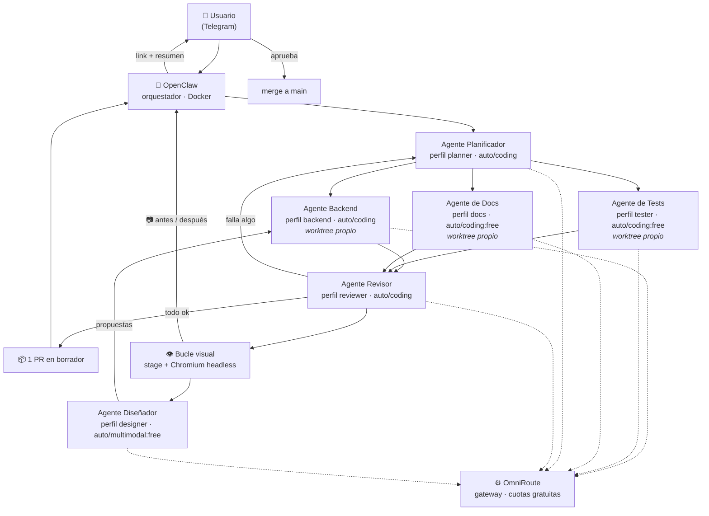

# self-hosted-ai-devops

Flota personal de agentes de IA, **autohospedada**, comandada desde el celular por **Telegram**, capaz de avanzar un repositorio de GitHub de forma autónoma: crear ramas, escribir código, correr tests y abrir Pull Requests.

Combina un modelo caro para **planificar y revisar** con modelos chinos baratos o gratuitos para **ejecutar**, de modo que el volumen de tokens se lo lleven los modelos económicos.

> **Estado:** infraestructura y runner persistente implementados · control y
> aprobación por Telegram pendientes de verificación integral · última
> actualización 2026-08-07

---

## Idea en 30 segundos

```
Tú, desde el celular:  "avanza el issue #12"
                        ↓ Telegram
La VM en tu propio ESXi trabaja sola durante unos minutos
                        ↓ Telegram
Tú:                     recibes el link de un Pull Request ya revisado
```

Sin nube. Sin abrir puertos en el router. Sin prender la PC.

---

## Arquitectura



Los tres agentes del medio trabajan **en paralelo, cada uno en su propio git worktree y su propia rama**. Nunca escriben en `main`: el merge lo autoriza siempre una persona.

Todas las llamadas a modelos pasan por **OmniRoute**, que traduce la Responses
API de Codex, aprovecha la suscripción ChatGPT Plus existente y aplica fallback
entre proveedores gratuitos. No se mantienen saldos ni claves comerciales.

Detalle completo en **[docs/arquitectura.md](docs/arquitectura.md)**.
El contrato operativo de Telegram, recuperación y aprobación está en
**[docs/ciclo-autonomo.md](docs/ciclo-autonomo.md)**.

---

## Stack

| Capa | Herramienta | Rol |
|---|---|---|
| Hipervisor | VMware ESXi 8.0 U3e (gratuito) | Hardware propio, sin costo de nube |
| Sistema operativo | **Ubuntu Server 24.04 LTS** | VM headless — [por qué Server y no Desktop](docs/decisiones.md#adr-006--ubuntu-server-y-no-ubuntu-desktop) |
| Orquestador | OpenClaw (Docker) | Escucha Telegram, reparte tareas |
| Gateway de modelos | OmniRoute (Docker) | Traduce APIs, enruta cuotas gratuitas y registra uso |
| Ejecutor de código | Codex CLI | Único ejecutor, 5 perfiles de agente |
| Aislamiento | Git worktrees | Cada agente en su directorio, un solo `.git` |
| Red remota | Tailscale | SSH desde el celular sin exponer el router |
| Repositorio | GitHub + PAT de alcance mínimo | Ramas, commits y PRs |
| Guardarraíles | Gitleaks + pre-commit | Impide que un agente commitee una clave |

---

## Los seis agentes

| Agente | Perfil | Modelo | Para qué | Costo |
|---|---|---|---|---|
| Planificador | `planner` | `auto/coding` | Divide la tarea en subtareas | Sin costo adicional |
| Backend | `backend` | `auto/coding` | Código de aplicación | Sin costo adicional |
| Tests | `tester` | `auto/coding:free` | Pruebas automatizadas | Gratis |
| Docs | `docs` | `auto/coding:free` | Documentación | Gratis |
| Revisor | `reviewer` | `auto/coding` | Une ramas, valida, abre el PR | Sin costo adicional |
| Diseñador | `designer` | `auto/multimodal:free` | Revisa capturas y propone CSS | Gratis |

El Diseñador solo entra si la tarea toca interfaz web — ver **[bucle visual](docs/bucle-visual.md)**.

Los perfiles de volumen fuerzan rutas `:free`; Planificador, Backend y Revisor
pueden usar Codex mediante la suscripción existente. Si no queda cuota, la tarea
se detiene sin generar cargos de API.

Prompts, límites y responsabilidades de cada uno en **[docs/agentes.md](docs/agentes.md)**.
Comparativa de modelos, proveedores y precios en **[docs/modelos.md](docs/modelos.md)**.

---

## Documentación

| Documento | Contenido |
|---|---|
| [docs/arranque.md](docs/arranque.md) | **Empezá acá** — los comandos manuales hasta que Codex toma el control |
| [docs/plan-ejecucion.md](docs/plan-ejecucion.md) | **63 tareas atómicas** con verificación — para que un agente lo implemente |
| [ESTADO.md](ESTADO.md) | Avance de la implementación, tarea por tarea |
| [docs/instalacion.md](docs/instalacion.md) | El mismo camino en 10 fases, explicado para leer |
| [docs/bucle-visual.md](docs/bucle-visual.md) | **Capturas sin escritorio, stage publicado e informe con imágenes** |
| [docs/arquitectura.md](docs/arquitectura.md) | Diagramas de componentes, flujo, worktrees y ramas |
| [docs/ciclo-autonomo.md](docs/ciclo-autonomo.md) | Comandos Telegram, estado, scheduler, recuperación y aprobación |
| [docs/agentes.md](docs/agentes.md) | Perfil, prompt de sistema y límites de cada agente |
| [docs/modelos.md](docs/modelos.md) | Modelos, proveedores, endpoints y topes de gasto |
| [docs/omniroute.md](docs/omniroute.md) | Gateway gratuito, seguridad, autenticación y recuperación |
| [docs/registro-proveedores-ia.md](docs/registro-proveedores-ia.md) | Registro paso a paso y almacenamiento seguro de claves de API |
| [docs/proyectos-referencia.md](docs/proyectos-referencia.md) | **Qué se copió del ecosistema open source y por qué** |
| [docs/decisiones.md](docs/decisiones.md) | ADRs: ESXi, OmniRoute, seguridad, worktrees y operación |
| [docs/seguridad.md](docs/seguridad.md) | Allowlist de Telegram, secretos, permisos, sandbox |
| [docs/runbook.md](docs/runbook.md) | Operación diaria, diagnóstico y recuperación |
| [infra/vm-esxi.md](infra/vm-esxi.md) | Specs y creación de la VM |
| [AGENTS.md](AGENTS.md) | Reglas del repo que los agentes leen solos |
| [CONTEXTO-PROYECTO.md](CONTEXTO-PROYECTO.md) | Documento de traspaso para retomar el proyecto |

---

## Cómo implementarlo

**Empezá por [docs/arranque.md](docs/arranque.md):** los comandos que corrés a mano hasta que Codex CLI puede tomar el control. Es el único tramo que no se automatiza — no hay agente todavía que lo haga.

Después, hay dos caminos al mismo lugar. Elegí uno:

| Si vas a… | Usá |
|---|---|
| Dárselo a un agente para que lo implemente | **[docs/plan-ejecucion.md](docs/plan-ejecucion.md)** — 63 tareas atómicas, cada una con su verificación y su acción ante fallo |
| Hacerlo vos, entendiendo cada paso | **[docs/instalacion.md](docs/instalacion.md)** — 10 fases explicadas |

Para el agente, la instrucción es literalmente:

```
Implementá el proyecto siguiendo docs/plan-ejecucion.md.
Empezá por la primera tarea sin marcar en ESTADO.md.
Verificá con ./scripts/verificar.sh antes de pasar a la fase siguiente.
Pará al llegar a una tarea marcada 👤.
```

De las 63 tareas, **33 las hace el agente y 30 requieren una persona** — crear la VM en ESXi, hablar con BotFather, obtener claves de API. El plan marca cuál es cuál.

---

## Instalación resumida

El detalle son 10 fases en [docs/instalacion.md](docs/instalacion.md); esto es solo el mapa.

```bash
# En la VM Ubuntu Server 24.04 LTS
sudo apt update && sudo apt -y upgrade
curl -fsSL https://get.docker.com | sh           # Docker
curl -fsSL https://tailscale.com/install.sh | sh # Tailscale
npm i -g @openai/codex                           # Codex CLI

git clone https://github.com/marksato13/self-hosted-ai-devops.git
cd self-hosted-ai-devops
cp .env.example .env        # completar con tus claves — NUNCA se commitea
./scripts/instalar-config-codex.sh
pre-commit install                                # guardarraíles de secretos
docker compose --env-file .env -f infra/docker-compose.yml up -d
```

Y el ciclo de una tarea, ya con todo montado:

```bash
./scripts/solicitar-issue.sh 12     # OpenClaw solo escribe en una cola
./scripts/instalar-runner.sh        # activa path + reconciliación periódica
./scripts/control-runner.sh estado  # estado local: activo o pausado
./scripts/bucle-visual.sh 12       # (si es web) mira, corrige y manda la foto
./scripts/limpiar-worktrees.sh 12  # limpia al aprobar
```

Tras verificar la allowlist desde otra cuenta, `AI_AUTONOMOUS_MODE=on` permite
que el timer continúe con issues etiquetados `agente:lista`, uno por vez. Los
merges siguen necesitando la confirmación de dos fases desde Telegram.

---

## Fases y criterios de aceptación

| Fase | Qué se hace | Listo cuando |
|---|---|---|
| 1–4 | VM, Ubuntu Server, Tailscale, Docker | Entrás por SSH desde el celular y `docker run hello-world` corre |
| 5 | OmniRoute (gateway) | `auto/coding:free` responde con costo cero |
| 6–7 | Bot de Telegram + OpenClaw | Tu mensaje recibe respuesta; el de otra cuenta se ignora |
| 8 | Codex CLI y los 5 perfiles | Los cinco perfiles responden |
| 9 | GitHub, gitleaks y primer PR | Desde Telegram logras que abra un PR trivial |
| 10 | La flota completa | Una tarea genera 3 ramas y **un solo** PR consolidado |
| 11 | Bucle visual *(opcional)* | Llega al celular la foto del antes y el después |

Logrado cuando se cumplen las 10 y el gasto mensual queda bajo el tope de [docs/modelos.md](docs/modelos.md#topes-de-gasto).

---

## Seguridad — leer antes de encender nada

Tres cosas que, si se omiten, duelen:

1. **Un bot de Telegram es público.** Cualquiera que lo encuentre puede escribirle. Sin una allowlist con tu `chat_id`, un desconocido tiene shell en tu VM.
2. **Las claves nunca van al repo.** Van en `.env`, que está en `.gitignore` desde el primer commit.
3. **`main` va protegida.** Solo se entra por PR, para que un agente descontrolado no pueda escribir en la rama principal.

Las medidas completas están en **[docs/seguridad.md](docs/seguridad.md)**.
El procedimiento de ramas, verificaciones y PR está en **[docs/flujo-github.md](docs/flujo-github.md)**.

---

## Aviso sobre modelos gratuitos

Las cuotas y modelos externos cambian con frecuencia. OmniRoute selecciona el
modelo disponible en cada petición; revisá periódicamente el catálogo y sus
términos. El contenedor y la ruta `auto/coding:free` fueron probados en esta VM
el 2026-08-07.

---

## Licencia

Proyecto personal. Sin licencia definida todavía.
