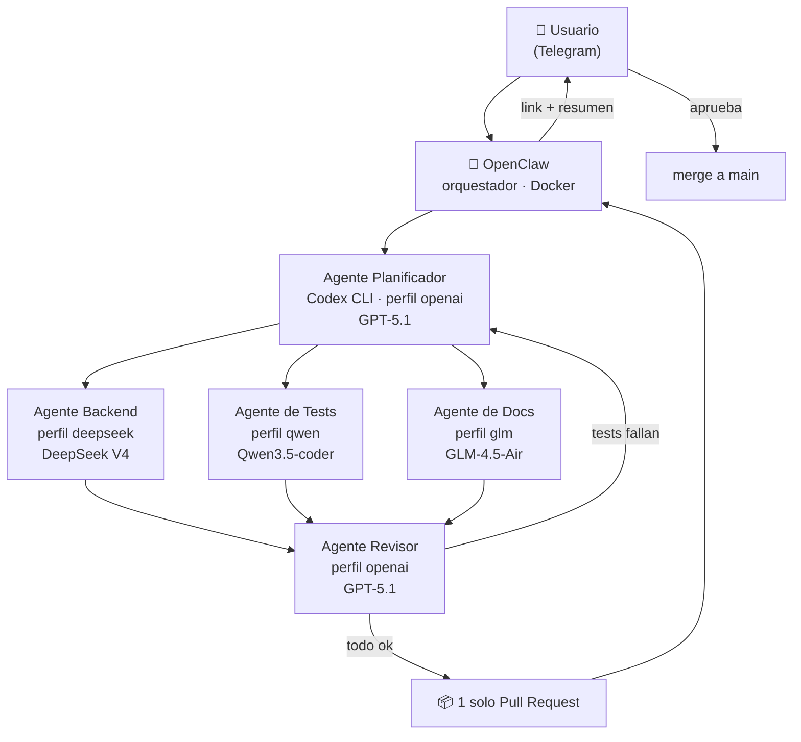

# self-hosted-ai-devops

Flota personal de agentes de IA, **autohospedada**, comandada desde el celular por **Telegram**, capaz de avanzar un repositorio de GitHub de forma autónoma: crear ramas, escribir código, correr tests y abrir Pull Requests.

Combina un modelo caro para **planificar y revisar** con modelos chinos baratos o gratuitos para **ejecutar**, de modo que el volumen de tokens se lo lleven los modelos económicos.

> **Estado:** diseño cerrado · implementación no iniciada · última actualización 2026-08-05

---

## Idea en 30 segundos

```
Tú, desde el celular:  "avanza el issue #12"
                        ↓ Telegram
La VM en tu propio ESXi trabaja sola durante unos minutos
                        ↓ Telegram
Tú:                     recibes el link de un Pull Request ya revisado
```

Sin nube. Sin abrir puertos en el router. Sin prender la PC.

---

## Arquitectura



Los tres agentes del medio trabajan **en paralelo, cada uno en su propia rama**. Nunca escriben en `main`: el merge lo autoriza siempre una persona.

Detalle completo en **[docs/arquitectura.md](docs/arquitectura.md)**.

---

## Stack

| Capa | Herramienta | Rol |
|---|---|---|
| Hipervisor | VMware ESXi 8.0 U3e (gratuito) | Hardware propio, sin costo de nube |
| Sistema operativo | **Ubuntu Server 24.04 LTS** | VM headless — [por qué Server y no Desktop](docs/decisiones.md#adr-006--ubuntu-server-y-no-ubuntu-desktop) |
| Orquestador | OpenClaw (Docker) | Escucha Telegram, reparte tareas |
| Ejecutor de código | Codex CLI | Único ejecutor, 4 perfiles de modelo |
| Red remota | Tailscale | SSH desde el celular sin exponer el router |
| Repositorio | GitHub + PAT de alcance mínimo | Ramas, commits y PRs |

---

## Los cuatro agentes

| Agente | Perfil Codex | Modelo | Para qué | Costo |
|---|---|---|---|---|
| Planificador | `openai` | GPT-5.1 | Divide la tarea en subtareas | Incluido en ChatGPT Plus |
| Backend | `deepseek` | DeepSeek V4 | Código de aplicación | Barato |
| Tests | `qwen` | Qwen3.5-coder | Pruebas automatizadas | Barato |
| Docs | `glm` | GLM-4.5-Air | Documentación | Gratis |
| Revisor | `openai` | GPT-5.1 | Une ramas, valida, abre el PR | Incluido en ChatGPT Plus |

Prompts, límites y responsabilidades de cada uno en **[docs/agentes.md](docs/agentes.md)**.
Comparativa de modelos, proveedores y precios en **[docs/modelos.md](docs/modelos.md)**.

---

## Documentación

| Documento | Contenido |
|---|---|
| [docs/instalacion.md](docs/instalacion.md) | **Paso a paso completo**, de la VM vacía al primer PR |
| [docs/arquitectura.md](docs/arquitectura.md) | Diagramas de componentes, flujo y ramas |
| [docs/agentes.md](docs/agentes.md) | Perfil, prompt y límites de cada agente |
| [docs/modelos.md](docs/modelos.md) | Modelos, proveedores, endpoints y costos |
| [docs/decisiones.md](docs/decisiones.md) | ADRs: por qué ESXi y no AWS, Server y no Desktop, etc. |
| [docs/seguridad.md](docs/seguridad.md) | Allowlist de Telegram, secretos, permisos, sandbox |
| [docs/runbook.md](docs/runbook.md) | Operación diaria, diagnóstico y recuperación |
| [infra/vm-esxi.md](infra/vm-esxi.md) | Specs y creación de la VM |
| [CONTEXTO-PROYECTO.md](CONTEXTO-PROYECTO.md) | Documento de traspaso para retomar el proyecto |

---

## Instalación resumida

El detalle está en [docs/instalacion.md](docs/instalacion.md); esto es solo el mapa.

```bash
# En la VM Ubuntu Server 24.04 LTS
sudo apt update && sudo apt -y upgrade
curl -fsSL https://get.docker.com | sh          # Docker
curl -fsSL https://tailscale.com/install.sh | sh # Tailscale
npm i -g @openai/codex                           # Codex CLI

git clone https://github.com/marksato13/self-hosted-ai-devops.git
cd self-hosted-ai-devops
cp .env.example .env        # completar con tus claves — NUNCA se commitea
cp config/codex-config.toml.example ~/.codex/config.toml
docker compose -f infra/docker-compose.yml up -d
```

---

## Fases y criterios de aceptación

| Fase | Qué se hace | Listo cuando |
|---|---|---|
| 1 | Repo, README y documentación | El repo se ve completo en GitHub |
| 2 | VM Ubuntu Server + Docker + Tailscale | Entras por SSH desde el celular y `docker run hello-world` corre |
| 3 | Bot de Telegram + OpenClaw | Tu mensaje recibe respuesta; el de otra cuenta se ignora |
| 4 | Un agente (perfil `openai`) | Desde Telegram logras que abra un PR trivial |
| 5 | La flota completa | Una tarea genera 3 ramas y **un solo** PR consolidado |

Se considera el proyecto logrado cuando se cumplen las 5 y el gasto mensual en APIs queda bajo el tope definido en [docs/modelos.md](docs/modelos.md#topes-de-gasto).

---

## Seguridad — leer antes de encender nada

Tres cosas que, si se omiten, duelen:

1. **Un bot de Telegram es público.** Cualquiera que lo encuentre puede escribirle. Sin una allowlist con tu `chat_id`, un desconocido tiene shell en tu VM.
2. **Las claves nunca van al repo.** Van en `.env`, que está en `.gitignore` desde el primer commit.
3. **`main` va protegida.** Solo se entra por PR, para que un agente descontrolado no pueda escribir en la rama principal.

Las medidas completas están en **[docs/seguridad.md](docs/seguridad.md)**.

---

## Aviso sobre versiones

Los nombres y versiones de modelos citados (GPT-5.1, DeepSeek V4, Qwen3.5-coder, GLM-4.5-Air), los endpoints de cada proveedor y el formato exacto de configuración de OpenClaw y Codex CLI provienen de la investigación de diseño y **deben confirmarse contra la documentación oficial al momento de instalar**. Los archivos de `config/` e `infra/` son plantillas, no configuraciones probadas.

---

## Licencia

Proyecto personal. Sin licencia definida todavía.
