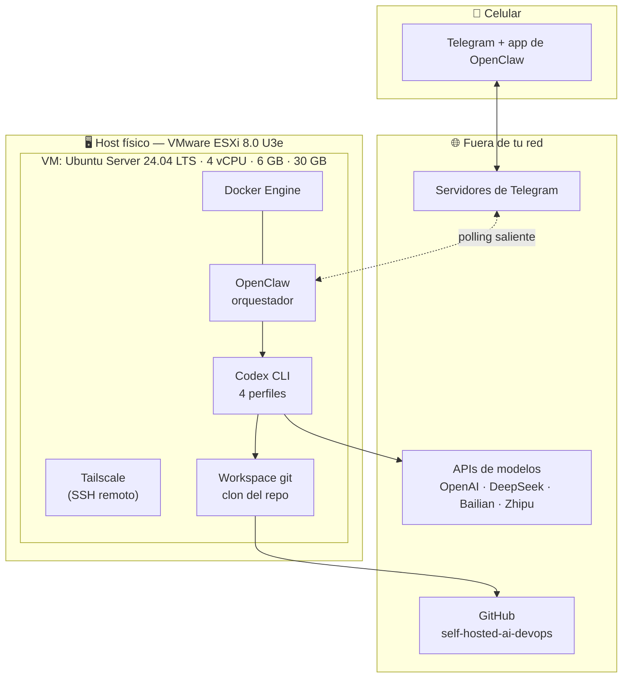
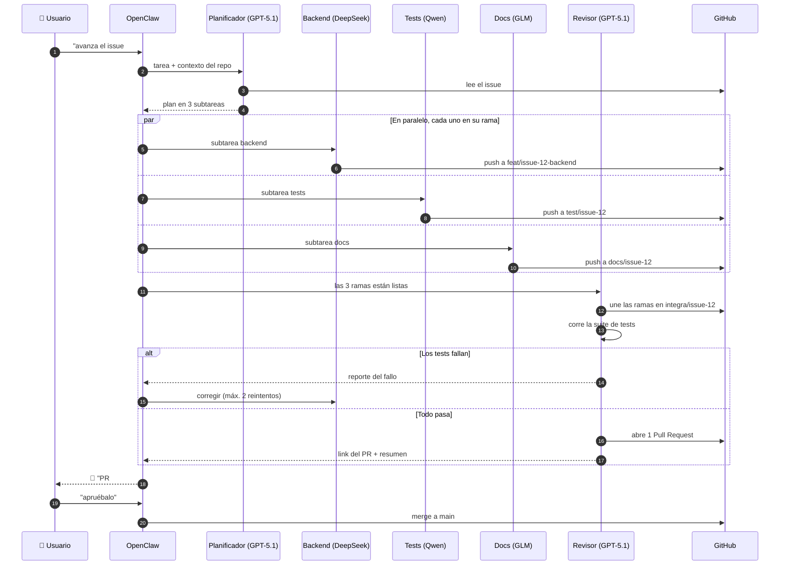
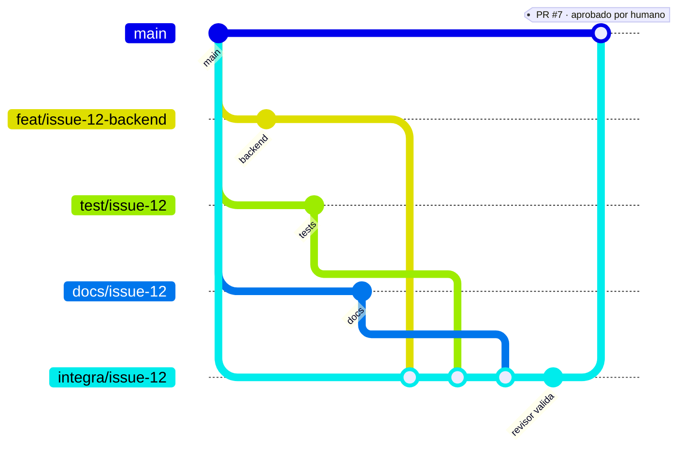
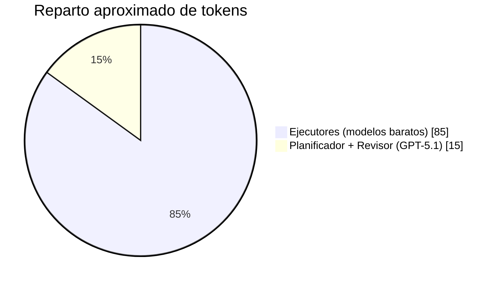

# Arquitectura

Cómo están organizadas las piezas y cómo se hablan entre sí.

---

## 1. Vista de componentes

**Lo importante de este diagrama:** todas las flechas que cruzan el borde del host **salen** desde la VM. Nada entra desde afuera. Telegram funciona por *polling* — el bot le pregunta a los servidores de Telegram si hay mensajes nuevos — así que **no hay que abrir un solo puerto en el router**. Tailscale cubre el acceso SSH por una red privada, sin exponer nada a internet.

---

## 2. Flujo de una tarea, de principio a fin

---

## 3. Estrategia de ramas

Reglas, sin excepciones:

| Regla | Motivo |
|---|---|
| Un agente = una rama | Evita que dos modelos se pisen el mismo archivo |
| Nadie hace push a `main` | `main` está protegida en GitHub |
| El Revisor es el único que integra | Un solo punto donde se resuelven los conflictos |
| **El merge final lo aprueba una persona** | El humano es el freno de mano del sistema |
| Máximo 2 reintentos por subtarea | Un bucle infinito quema créditos de madrugada |

Convención de nombres: `feat/`, `test/`, `docs/`, `fix/` + `issue-<n>` + sufijo del agente si hace falta.

---

## 4. Por qué la división planificador / ejecutores / revisor

El costo no se reparte parejo. Planificar y revisar consume **pocos tokens pero requiere criterio**; escribir código consume **muchos tokens con criterio moderado**.

De ahí sale el ahorro: el 85 % del volumen se procesa con modelos baratos o gratis, y el modelo caro —que además ya está pagado dentro de ChatGPT Plus— se reserva para las dos etapas donde equivocarse sale caro.

---

## 5. Qué corre dónde

| Componente | Dónde vive | Se reinicia con |
|---|---|---|
| OpenClaw | Contenedor Docker en la VM | `docker compose restart` |
| Codex CLI | Binario en el host de la VM (no en contenedor) | No aplica, se invoca por tarea |
| Workspace git | `~/workspace/` en la VM | Se puede reclonar sin perder nada |
| Secretos | `~/self-hosted-ai-devops/.env`, permisos `600` | Se restauran a mano |
| Estado de tareas | Volumen Docker de OpenClaw | Sobrevive al reinicio del contenedor |

**Punto sin resolver:** dónde queda exactamente la memoria persistente de tareas entre reinicios de OpenClaw. Verificar al llegar a la Fase 3 y documentar aquí.

---

## 6. Modos de falla previstos

| Si pasa esto | El sistema debería | Estado |
|---|---|---|
| Un agente entra en bucle | Cortar a los 2 reintentos y avisar por Telegram | ⚠️ Por implementar |
| Se cae la API de un proveedor | Reportar el fallo, no reintentar en bucle | ⚠️ Por implementar |
| Conflicto de merge entre ramas | El Revisor lo resuelve; si no puede, escala al usuario | ⚠️ Por implementar |
| Un desconocido escribe al bot | Ignorarlo por la allowlist de `chat_id` | 🔴 **Crítico** — ver [seguridad.md](seguridad.md) |
| Se reinicia la VM | Docker levanta OpenClaw solo (`restart: unless-stopped`) | ✅ Contemplado en el compose |
| Se acaba el crédito de un proveedor | Avisar por Telegram, no cambiar de modelo en silencio | ⚠️ Por implementar |
