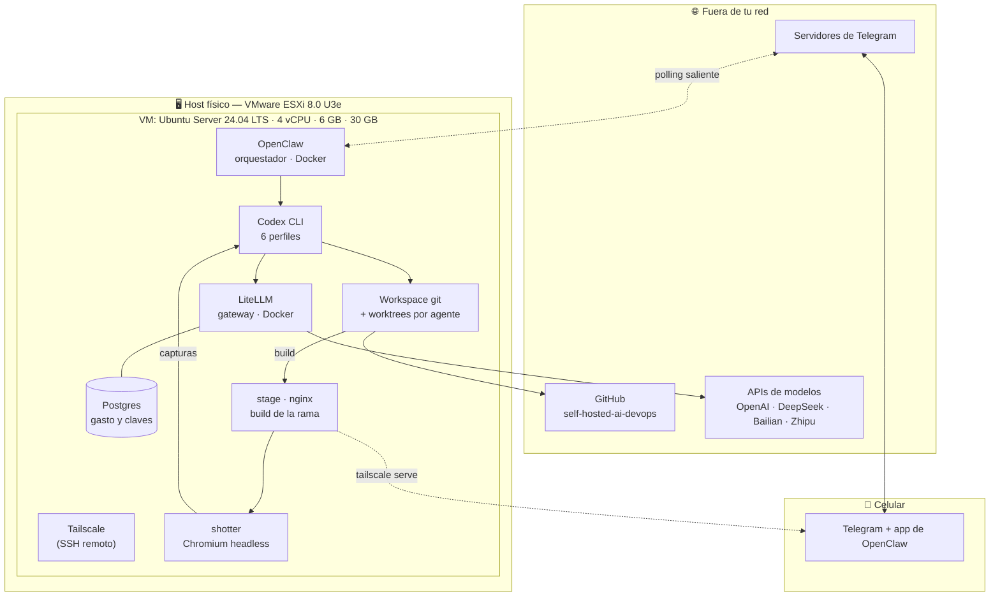
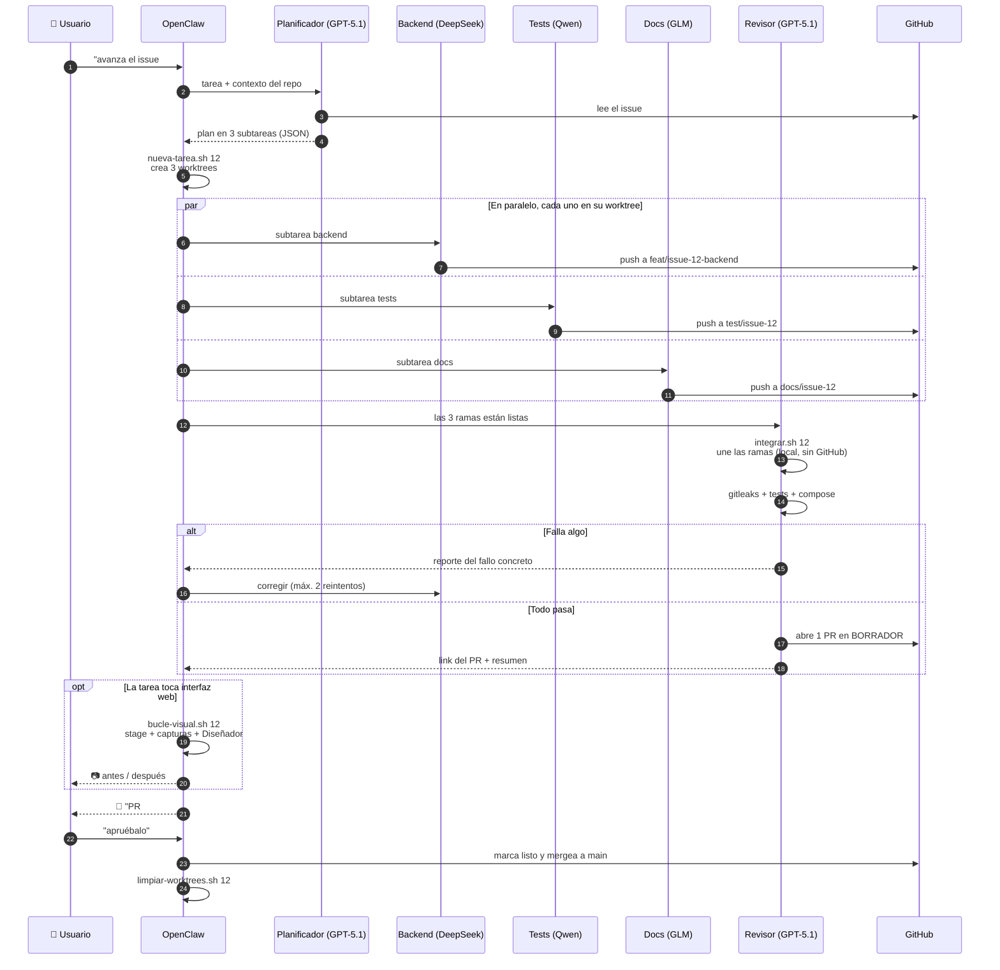
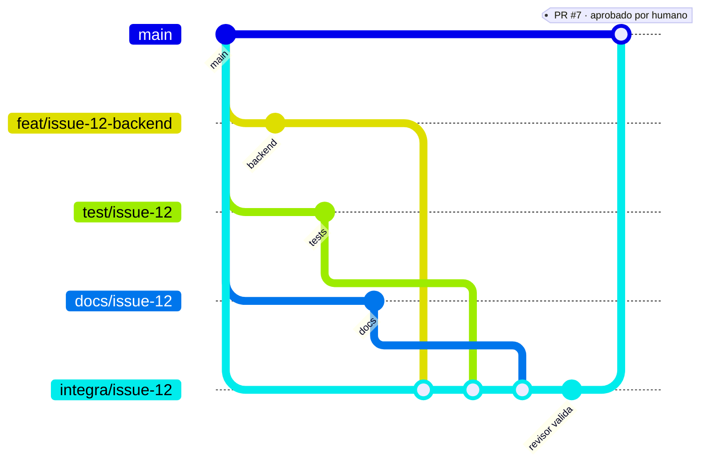
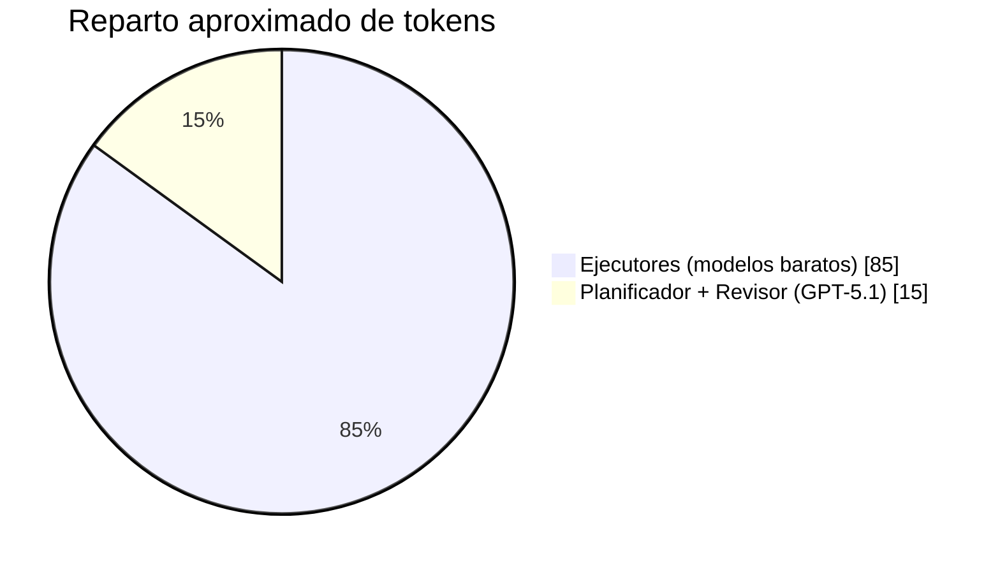

# Arquitectura

Cómo están organizadas las piezas y cómo se hablan entre sí.

---

## 1. Vista de componentes



**Dos cosas que este diagrama muestra y conviene no pasar por alto:**

1. **Todas las flechas que cruzan el borde del host salen.** Nada entra. Telegram funciona por *polling* — el bot pregunta a los servidores de Telegram si hay mensajes — así que **no hay que abrir un solo puerto en el router**. Tailscale cubre el SSH por una red privada.

2. **Codex no habla con los proveedores: habla con LiteLLM.** Es obligatorio, no una comodidad. Codex solo entiende la Responses API; DeepSeek, Qwen y GLM solo hablan Chat Completions. LiteLLM traduce, y de paso aplica los topes de gasto y registra cuánto consumió cada agente ([ADR-010](decisiones.md#adr-010--litellm-como-gateway-de-modelos)).

3. **El `stage` es la única flecha que vuelve al celular sin pasar por Telegram**, y va por la red privada de Tailscale — no por internet. `shotter` es Chromium headless: es lo que permite que una VM sin escritorio produzca capturas de pantalla ([bucle-visual.md](bucle-visual.md)). Ambos servicios viven en un `profile` aparte del compose y **no arrancan** si el proyecto no tiene interfaz web.

---

## 1.1 Dónde trabaja cada agente

Los tres agentes en paralelo no comparten directorio: cada uno tiene su **git worktree**, y los tres comparten un único `.git` ([ADR-011](decisiones.md#adr-011--git-worktrees-no-clones-por-agente)).

```
~/workspace/
├── self-hosted-ai-devops/          ← repo principal, siempre en main
│   └── .git/                       ← el único .git de todos
├── worktrees/
│   ├── issue-12-backend/           → rama feat/issue-12-backend
│   ├── issue-12-tests/             → rama test/issue-12
│   └── issue-12-docs/              → rama docs/issue-12
├── stage/                          ← build publicado; se BORRA en cada vuelta
└── artefactos/                     ← capturas, diffs e informes
    ├── base/                       ← la referencia: cómo se ve main
    ├── issue-12-v0/                ← antes de tocar nada
    └── issue-12-v1/  └── diff/     ← después, y lo que cambió en rojo
```

`stage/` y `artefactos/` no están versionados: se regeneran en cada corrida.

Esto es lo que permite que el Revisor una las tres ramas **sin pasar por GitHub**: ya las tiene localmente. Con clones separados habría que pushear y traer todo antes de poder integrar.

Se crean y se borran con [`scripts/nueva-tarea.sh`](../scripts/nueva-tarea.sh) y [`scripts/limpiar-worktrees.sh`](../scripts/limpiar-worktrees.sh).

---

## 2. Flujo de una tarea, de principio a fin



---

## 3. Estrategia de ramas



Reglas, sin excepciones:

| Regla | Motivo |
|---|---|
| Un agente = una rama | Evita que dos modelos se pisen el mismo archivo |
| Nadie hace push a `main` | `main` está protegida en GitHub |
| El Revisor es el único que integra | Un solo punto donde se resuelven los conflictos |
| **El merge final lo aprueba una persona** | El humano es el freno de mano del sistema |
| Máximo 2 reintentos por subtarea | Un bucle infinito quema créditos de madrugada |

Convención de nombres: `feat/`, `test/`, `docs/`, `fix/` + `issue-<n>` + sufijo del agente si hace falta.

---

## 4. Por qué la división planificador / ejecutores / revisor

El costo no se reparte parejo. Planificar y revisar consume **pocos tokens pero requiere criterio**; escribir código consume **muchos tokens con criterio moderado**.



De ahí sale el ahorro: el 85 % del volumen se procesa con modelos baratos o gratis, y el modelo caro —que además ya está pagado dentro de ChatGPT Plus— se reserva para las dos etapas donde equivocarse sale caro.

---

## 5. Qué corre dónde

| Componente | Dónde vive | Se reinicia con |
|---|---|---|
| OpenClaw | Contenedor Docker | `docker compose restart openclaw-gateway` |
| LiteLLM | Contenedor Docker | `docker compose restart litellm` |
| Postgres (gasto, claves virtuales) | Contenedor + volumen `postgres-data` | Sobrevive a todo salvo borrar el volumen |
| Codex CLI | Binario en el host de la VM, no en contenedor | No aplica: se invoca por tarea |
| `stage` (nginx) | Contenedor Docker, `profile: visual` | Solo arranca durante el bucle visual |
| `shotter` (Chromium) | Contenedor efímero, `run --rm` | No queda corriendo: nace y muere por captura |
| Workspace y worktrees | `~/workspace/` | Se reclona sin perder nada |
| Capturas y línea base | `~/workspace/artefactos/` | Se regeneran; solo `base/` conviene conservar |
| Secretos | `~/self-hosted-ai-devops/.env`, permisos `600` | Se restauran a mano |
| Estado de OpenClaw | `${OPENCLAW_CONFIG_DIR}` | Configuración, sesiones y memoria persistente |
| Estado del runner | `${AI_STATE_DIR}` | Cola, logs, planes y resultados por issue |

**Punto sin resolver:** dónde queda exactamente la memoria persistente de tareas entre reinicios de OpenClaw. Verificar al llegar a la Fase 6 y documentar aquí.

---

## 6. Modos de falla previstos

| Si pasa esto | El sistema debería | Cubierto por |
|---|---|---|
| Un agente entra en bucle de reintentos | Cortar a los 2 intentos y avisar | `MAX_RETRIES_PER_TASK` |
| Un agente se cuelga sin reintentar ni terminar | Matarlo y avisar | `TASK_TIMEOUT_MINUTES` |
| Un agente gasta de más | Cortarle el crédito sin tocar a los demás | Clave virtual con presupuesto propio en LiteLLM |
| Se cae la API de un proveedor | Caer al modelo de respaldo, no reintentar en bucle | `fallbacks` en `litellm-config.yaml` |
| Conflicto de merge entre ramas | El Revisor lo resuelve; si es ambiguo, escala al usuario | `scripts/integrar.sh` sale con código 2 |
| Un agente commitea una clave | Bloquear el commit antes de que exista | Gitleaks en pre-commit + verificación en `integrar.sh` |
| Un agente intenta escribir en `main` | Rechazarlo | Branch protection + hook `no-commit-to-branch` |
| Un desconocido escribe al bot | Ignorarlo | 🔴 Allowlist de `chat_id` — ver [seguridad.md](seguridad.md) |
| Se reinicia la VM | Todo vuelve solo | `restart: unless-stopped` + arranque automático en ESXi |
| Se acaba el crédito de un proveedor | Avisar, no cambiar de modelo en silencio | Registro de gasto en LiteLLM |
| El bucle visual empeora el diseño | Revertir al punto de retorno y mandar las dos fotos | `bucle-visual.sh` sale con código 1 |
| El bucle visual no encuentra nada que arreglar | Terminar, no inventar cambios | El Diseñador responde `SIN-CAMBIOS` |
| El modelo del Diseñador no ve imágenes | **No está cubierto en caliente** | Se detecta antes, en T057 — falla en silencio si se saltea |

Los tres frenos —reintentos, tiempo y presupuesto— atrapan modos de falla distintos y son independientes entre sí ([ADR-014](decisiones.md#adr-014--tres-frenos-no-uno)).
