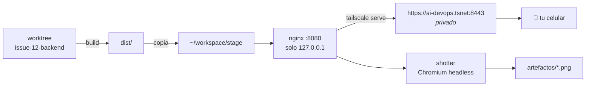
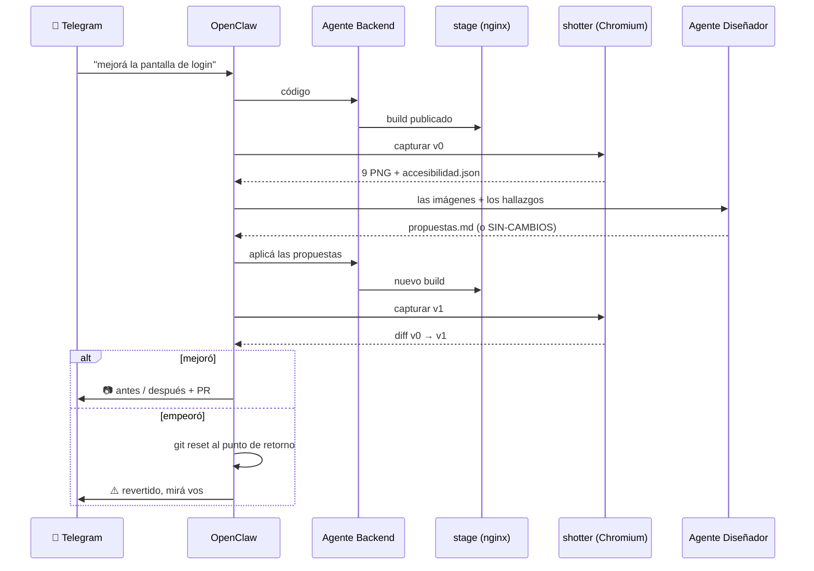

# Bucle visual

Cómo la flota **ve** lo que construye, lo corrige y te manda la foto al celular.

Es la pieza que faltaba: hasta acá los agentes escribían código a ciegas. Un
test verde no dice nada sobre un botón que en móvil queda debajo del pliegue.

---

## Las tres preguntas que responde este documento

| Pregunta | Respuesta corta |
|---|---|
| ¿Cómo toma capturas una VM **sin escritorio**? | Chromium *headless* en Docker. No necesita pantalla ni GNOME |
| ¿Puedo publicar un **stage** para mirarlo? | Sí: nginx + `tailscale serve` → URL HTTPS privada, sin abrir el router |
| ¿Puede reportar por **WhatsApp**? | Sí, pero las imágenes conviene mandarlas por Telegram. [Por qué](#5-el-canal-del-informe) |

---

## 1. Capturas en Ubuntu Server, sin escritorio

La duda es razonable: si la VM no tiene entorno gráfico, ¿qué renderiza la página?

**Chromium headless renderiza en memoria.** No dibuja en una pantalla; compone
el mapa de píxeles internamente y lo escribe a un PNG. No hace falta X11, ni
Wayland, ni un servidor virtual tipo Xvfb. Esto es exactamente lo que hace
cualquier CI de GitHub Actions, que tampoco tiene monitor.

Esto **confirma** la decisión de [ADR-006](decisiones.md#adr-006--ubuntu-server-y-no-ubuntu-desktop):
instalar Ubuntu Desktop para "poder ver el navegador" habría gastado 3 GB de RAM
sin resolver nada, porque el agente igual no mira una pantalla — mira un archivo.

El contenedor `shotter` parte de la imagen oficial de Playwright, que ya trae los
tres navegadores con sus dependencias resueltas. Instalar Chromium a mano en
Ubuntu Server es una tarde persiguiendo `libnss3`, `libatk-1.0`, `libgbm1`.

```
infra/shotter/Dockerfile     Chromium + Playwright + axe-core
infra/shotter/capturar.mjs   toma las fotos y audita accesibilidad
infra/shotter/comparar.mjs   diferencia dos conjuntos, píxel a píxel
```

Cada corrida deja, por cada ruta y cada tamaño de pantalla:

```
~/workspace/artefactos/issue-12-v1/
├── inicio__movil.png          390 x 844
├── inicio__tablet.png         834 x 1112
├── inicio__escritorio.png    1440 x 900
├── login__movil.png
├── …
├── accesibilidad.json         hallazgos de axe-core (objetivos)
├── resumen.json               qué se capturó y cuándo
└── diff/                      lo que cambió, pintado en rojo
```

### Dos detalles que arruinan una comparación si se ignoran

**Animaciones.** Dos capturas de la misma página idéntica dan diferencias si hay
una transición a medio camino o un cursor parpadeando. `capturar.mjs` inyecta CSS
que congela `animation`, `transition` y `caret-color` antes de disparar.

**Alturas distintas.** Una captura de página completa mide distinto si el
contenido creció. `comparar.mjs` encuadra ambas al tamaño mayor sobre fondo
blanco antes de compararlas; sin eso, `pixelmatch` directamente falla.

---

## 2. El stage publicado



Un comando:

```bash
./scripts/publicar-stage.sh 12 --tailnet
# ✅ Stage local:  http://localhost:8080
# ✅ Desde el celular: https://ai-devops.tuscale.ts.net:8443
```

Qué hace: compila el worktree de esa tarea con `STAGE_BUILD_CMD`, vuelca el
resultado en `STAGE_DIR`, levanta nginx y —con `--tailnet`— lo expone en tu red
privada de Tailscale.

### `serve` y no `funnel`

Tailscale ofrece dos cosas parecidas con consecuencias muy distintas:

| Comando | Quién lo ve | Uso acá |
|---|---|---|
| `tailscale serve` | Solo tus dispositivos, con Tailscale encendido | ✅ el que usamos |
| `tailscale funnel` | **Internet entero**, URL pública | ❌ no |

Un stage muestra trabajo a medio hacer generado por un agente. Publicarlo al
mundo por comodidad es exactamente la clase de decisión que después se lamenta.
Si alguna vez hace falta mostrarle algo a otra persona, se prende `funnel` para
esa sesión y se apaga. Ver [ADR-017](decisiones.md#adr-017--el-stage-va-a-la-tailnet-no-a-internet).

El puerto **nunca** se redirige en el router. Igual que todo el resto del
sistema, el tráfico es saliente ([ADR-007](decisiones.md#adr-007--telegram-por-polling-sin-abrir-puertos)).

---

## 3. El ciclo completo



Un comando:

```bash
./scripts/bucle-visual.sh 12              # dos vueltas, aplica cambios
./scripts/bucle-visual.sh 12 --solo-mirar # captura y reporta, no toca código
```

---

## 4. Qué juzga la máquina y qué no

Acá está el límite honesto de todo esto, y conviene tenerlo claro antes de
esperar de más.

| Aspecto | ¿Automatizable? | Cómo |
|---|---|---|
| Contenido cortado o desbordado | ✅ Sí | Se ve en la captura, el modelo lo detecta |
| Contraste insuficiente | ✅ Sí | axe-core lo mide, no lo opina |
| Áreas táctiles chicas en móvil | ✅ Sí | Regla WCAG, medible en píxeles |
| Etiquetas y foco de teclado | ✅ Sí | axe-core |
| Regresión: "esto antes no se veía así" | ✅ Sí | `comparar.mjs`, píxel a píxel |
| Jerarquía visual, ritmo, criterio | ❌ No | Va al humano, como foto |
| "¿Está lindo?" | ❌ No | No es una pregunta con respuesta verificable |

Por eso **la puerta automática del bucle es la accesibilidad, no el gusto**: es
el único criterio que sube o baja con un número. Si los hallazgos de axe no
bajan, el bucle se corta — no sigue quemando tokens buscando una mejora que no
sabe medir. Lo demás te llega al celular como imagen para que decidas vos.

El Diseñador recibe una **lista cerrada de cinco cosas que revisar**, no un
"mejorá el diseño". Un modelo al que le pedís que mejore algo siempre encuentra
qué cambiar, aunque no haga falta: ese es el camino directo a un bucle infinito
que reescribe el CSS cada noche.

---

## 5. El canal del informe

La pregunta era WhatsApp. La respuesta corta: **se puede, pero las imágenes van
mejor por Telegram**, y conviene entender por qué antes de elegir.

| Canal | Imágenes | Costo | Riesgo | Veredicto |
|---|---|---|---|---|
| **Telegram** | `sendPhoto` / álbumes de 10 | Gratis | Ninguno | ✅ canal principal |
| **WhatsApp Cloud API** (oficial, Meta) | Sí, subiendo el archivo | Por conversación | Ventana de 24 h | ⚠️ ver abajo |
| **Puente no oficial** (número personal por QR) | Sí | Gratis | **Baneo del número** | ❌ no con tu número |

**La ventana de 24 horas** es el problema real de la API oficial: solo podés
mandar un mensaje libre si el usuario te escribió en las últimas 24 h. Fuera de
eso hace falta una plantilla aprobada por Meta, y las plantillas no llevan una
captura arbitraria. Un informe que sale a las 3 de la mañana, cuando hace dos
días que no le escribís al bot, **no llega**.

Telegram no tiene esa restricción. Por eso el bot ya está en Telegram y el
informe con imágenes también.

Si igual querés WhatsApp, `scripts/reportar.sh` lo soporta con
`WHATSAPP_MODO=cloud` (oficial) o `openclaw` (el canal de OpenClaw). En ese caso:
**un número secundario, nunca el personal**. Ver [ADR-016](decisiones.md#adr-016--las-imágenes-por-telegram-whatsapp-como-aviso).

```bash
# Manual, para probar
./scripts/reportar.sh "así quedó el login" ~/workspace/artefactos/issue-12-v1/login__movil.png
```

---

## 6. Dónde encaja en el flujo que ya existe

El bucle visual **no reemplaza** nada del ciclo actual: se mete entre la
integración y el aviso.

```
nueva-tarea.sh  →  los 3 agentes  →  integrar.sh  →  ┌ bucle-visual.sh ┐  →  PR + 📷
                                                      └ (solo si es web) ┘
```

Si la tarea no toca interfaz, el bucle se saltea: `integrar.sh` abre el PR como
siempre. La regla la aplica el Planificador al armar el plan.

---

## 7. Costo

Cada vuelta del bucle son ~9 imágenes que el Diseñador tiene que mirar. Las
imágenes se cobran por tokens y no salen baratas comparadas con texto.

| Freno | Valor | Dónde |
|---|---|---|
| Vueltas máximas | 2 | `--vueltas`, y el corte por "sin mejora medible" |
| Rutas capturadas | 3 | `config/capturas.json` |
| Presupuesto del Diseñador | 5 USD/mes | Clave virtual en LiteLLM |
| Modelo | uno de visión barato | `designer` en `infra/litellm-config.yaml` |

Tres rutas es una decisión deliberada: cada ruta de más multiplica por tres las
imágenes (una por viewport) y por tres el costo de cada vuelta.

---

## 8. Archivos de esta pieza

| Archivo | Qué hace |
|---|---|
| `infra/shotter/` | La imagen con Chromium headless y los dos scripts de Node |
| `infra/stage/nginx.conf` | Servidor del stage, sin caché y con `noindex` |
| `infra/docker-compose.visual.yml` | Servicios `stage` y `shotter`, en su propio `profile` |
| `config/capturas.json.example` | Qué rutas y qué tamaños capturar |
| `scripts/publicar-stage.sh` | Compila la rama y la publica |
| `scripts/capturar.sh` | Dispara las capturas |
| `scripts/comparar.sh` | Diferencia dos conjuntos |
| `scripts/reportar.sh` | Manda texto e imágenes al celular |
| `scripts/bucle-visual.sh` | El ciclo completo |

Instalación paso a paso: [plan-ejecucion.md — Fase 11](plan-ejecucion.md#fase-11--bucle-visual).
