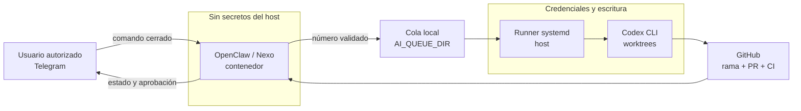
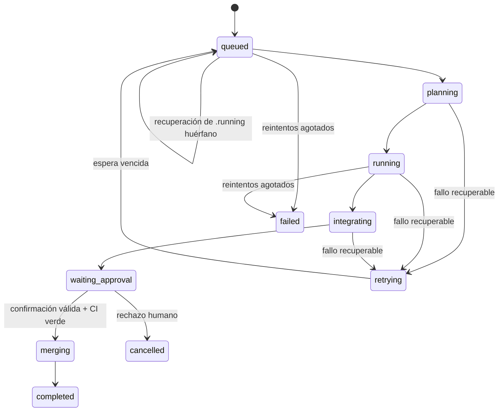
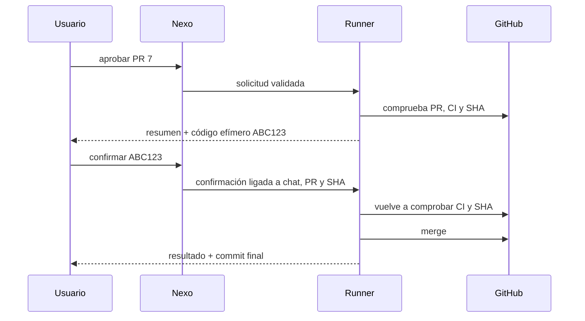

# Ciclo autónomo desde Telegram

Este documento define el contrato operativo para avanzar el proyecto objetivo
sin depender de una conversación interactiva. Telegram es el panel de control,
GitHub es la fuente de verdad y el host ejecuta trabajo aislado.

> **Estado al 2026-08-07:** el runner persistente, los worktrees, la integración
> y el PR en borrador están implementados. La traducción de comandos y las
> aprobaciones de dos fases desde Telegram todavía deben verificarse de extremo
> a extremo antes de considerarlas operativas.

## Arquitectura y frontera de confianza



OpenClaw no recibe shell libre, el token de GitHub ni las credenciales de
Codex. Solo puede escribir una solicitud numérica mediante el ejecutable
permitido. El runner vive en el host, lee la cola con un bloqueo exclusivo y
trabaja sobre `${AI_TARGET_REPO_DIR}`. En esta instalación:

```text
Plataforma: /home/m4rk/self-hosted-ai-devops
Proyecto:   /home/m4rk/workspace/ninjasec-platform
Estado:     /home/m4rk/.local/state/ai-devops
Cola:       /home/m4rk/.local/state/ai-devops/queue
```

Las rutas son locales a esta VM; otras instalaciones deben usar las variables
de `.env` y no copiar `/home/m4rk` literalmente.

## Comandos cerrados

El contrato previsto de Nexo acepta únicamente estas intenciones:

| Telegram | Acción permitida |
|---|---|
| `issue 12` | Encolar el issue numérico 12 una sola vez |
| `estado` | Consultar tarea activa, cola, último PR y bloqueo |
| `pausar` | Impedir que empiece otra tarea; no mata la activa |
| `reanudar` | Quitar la pausa y despertar el reconciliador |
| `aprobar PR 7` | Iniciar la primera fase de aprobación |
| `confirmar ABC123` | Confirmar el merge con código efímero |
| `rechazar PR 7` | Rechazar la aprobación; no borra ramas |
| `cancelar issue 12` | Solicitar cancelación segura, sin shell libre |

No se interpretan comandos Bash, rutas, opciones ni texto procedente de un
issue como instrucciones del sistema. Un mensaje de una cuenta fuera de
`TELEGRAM_ALLOWED_CHAT_IDS` se ignora.

## Máquina de estados



Cada transición actualiza atómicamente
`AI_STATE_DIR/issues/<n>/state.json` y agrega un evento a `events.jsonl`. El
estado nunca depende solamente del texto de un log.

## Cola, scheduler y recuperación

1. `solicitar-issue.sh` crea `issue-<n>.pending` con permisos privados y
   rechaza duplicados pendientes, activos, completados o fallidos.
2. `ai-devops-queue.path` despierta el servicio cuando cambia la cola.
3. `ai-devops-queue.timer` reconcilia una vez por minuto aunque se pierda un
   evento o la VM se reinicie.
4. `procesar-cola.sh` toma un bloqueo global y selecciona el primer issue
   numérico cuyo tiempo de reintento ya venció.
5. Cada invocación procesa como máximo una tarea. Así vuelve a comprobar la
   pausa y el estado entre tareas.
6. Un `.running` encontrado sin otro procesador activo se devuelve a
   `.pending` y deja un evento `recovered`.
7. Un fallo se reintenta hasta `MAX_RETRIES_PER_TASK`; la espera crece según el
   número de intento. Al agotarse, la solicitud pasa a `fallidas/`.

El scheduler no crea trabajo por iniciativa propia: procesa exclusivamente
issues que una persona haya puesto en alcance.

## Aprobación en dos fases

La aprobación desde Telegram se diseña para impedir un merge causado por un
mensaje viejo, ambiguo o reenviado:



El código debe ser de un solo uso, tener vencimiento y quedar ligado al
`chat_id`, número de PR y SHA exacto. Si cambia el SHA, falla la CI o vence el
código, no se fusiona. Migraciones de producción, secretos, publicación
externa, costes y operaciones destructivas conservan aprobación humana aunque
el resto del ciclo sea autónomo.

## Qué recibe el usuario

Nexo debe notificar únicamente hitos: aceptación, inicio, reintento, bloqueo,
PR abierto, CI final y resultado del merge. Los mensajes contienen issue, PR,
estado y enlaces; nunca tokens, cookies, contenido completo de `.env` ni logs
sin redacción.

## Criterio para declarar el ciclo operativo

- Un `issue N` autorizado crea una única solicitud.
- Otra cuenta de Telegram no logra consultar ni mutar el runner.
- Reiniciar el servicio durante `.running` recupera la tarea.
- Pausar evita que comience la siguiente tarea.
- Un fallo respeta reintentos y termina sin bucle infinito.
- Se abre un PR en borrador con verificaciones reales.
- Una confirmación vencida, de otro chat o con SHA diferente no fusiona.
- Una confirmación válida con CI verde fusiona y limpia los worktrees.

Hasta probar todos esos puntos, el sistema es **asistido**, no completamente
autónomo.
