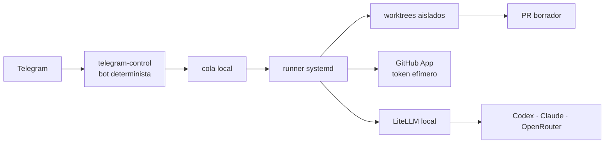

# Despliegue de producción

La versión actual separa las decisiones de IA del plano de control. Telegram
solo admite comandos cerrados; el runner es el único proceso que usa GitHub,
worktrees y Codex.



## Componentes

| Componente | Producción | Por qué |
|---|---|---|
| `telegram-control` | Docker | No interpreta lenguaje libre, no monta el repositorio ni recibe claves de GitHub. |
| LiteLLM | Docker | Endpoint OpenAI compatible, aliases por rol y una sola política de proveedores. |
| Runner | `systemd --user` en el host | Conserva los worktrees y aplica el sandbox de Codex. |
| GitHub App | GitHub | Token de instalación breve, limitado al repositorio, sin PAT persistente. |
| Secretos | `${AI_SECRETS_DIR}` | Un archivo por secreto, permisos `600`, montado como Docker Secrets. |
| Ollama | perfil Docker opcional | Solo tareas manuales locales; no fallback automático de cambios de código. |

No se usa Temporal aún. Una cola de archivos con bloqueo es más simple y ya
resuelve un solo repositorio. Añádelo cuando haya varios runners, esperas largas
o flujos que deban reanudarse tras caídas en pasos intermedios.

## Preparación única

En la VM Ubuntu Server, cloná el repositorio y creá configuración no secreta:

```bash
cp .env.example .env
chmod 600 .env
./scripts/preparar-entorno.sh
./scripts/preparar-secretos.sh
```

Completa `.env` con la allowlist de Telegram, la ruta de la cola, el ID de la
GitHub App y los aliases de modelos. Luego crea estos archivos con `chmod 600`:

```text
${AI_SECRETS_DIR}/telegram_bot_token
${AI_SECRETS_DIR}/github_app_private_key
${AI_SECRETS_DIR}/litellm_master_key       # generado por preparar-secretos.sh
${AI_SECRETS_DIR}/openai_api_key           # solo si usás OpenAI API
${AI_SECRETS_DIR}/anthropic_api_key        # solo si usás Claude
${AI_SECRETS_DIR}/openrouter_api_key       # solo si usás OpenRouter
```

Los archivos de proveedor no usados pueden existir vacíos para que Docker
Compose resuelva los mounts; LiteLLM solo debe recibir rutas configuradas con
una clave válida. Ajustá `infra/litellm/config.yaml` para que cada alias apunte
a modelos y proveedores que realmente usás.

## GitHub App

Creá una GitHub App privada e instalala únicamente en el repositorio objetivo.
Permisos mínimos: `Contents: Read and write`, `Issues: Read and write`,
`Pull requests: Read and write` y `Metadata: Read-only`. Guardá su PEM como
`github_app_private_key`; no ejecutes `gh auth login` ni guardes un PAT.

En cada ejecución el runner firma un JWT corto y solicita un token de
instalación. El token permanece solo en memoria como `GH_TOKEN` durante esa
ejecución y no se entrega al proceso Codex aislado.

## Local y servidor

Para pruebas: WSL2 Ubuntu + Docker Desktop, `AI_AUTONOMOUS_MODE=off`, bot y
repositorio de prueba. Docker Desktop se suspende con Windows, así que no es
operación nocturna.

Para producción: VM Ubuntu Server 24.04 en ESXi o mini-PC, 4 vCPU, 8 GB RAM y
40 GB de disco como mínimo inicial. Docker, runner y repositorios viven en la
misma VM; Tailscale da SSH privado. No expongas puertos ni uses Funnel para el
runner o LiteLLM.

## Arranque y comprobación

```bash
docker compose --env-file .env -f infra/docker-compose.yml up -d --build
./scripts/instalar-config-codex.sh
./scripts/instalar-runner.sh
docker compose --env-file .env -f infra/docker-compose.yml ps
```

Antes de activar autonomía, valida `/estado` desde una segunda cuenta no
autorizada, crea un issue de prueba y verifica que solo aparece un PR borrador.
El merge sigue requiriendo la confirmación humana de dos pasos.
