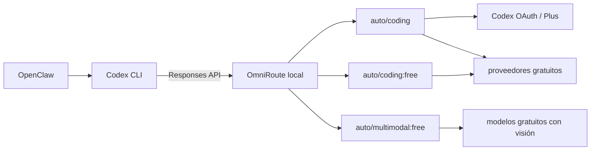

# OmniRoute: modelos gratuitos y Codex por suscripción

OmniRoute es el gateway de modelos de esta plataforma. Se ejecuta en Docker,
expone una API compatible con OpenAI y decide qué proveedor disponible atiende
cada petición. Sustituye a LiteLLM y a las claves comerciales individuales.

## Objetivo económico

- Costo adicional de API: **USD 0**.
- Codex usa la suscripción ChatGPT Plus ya contratada, mediante OAuth.
- El resto del tráfico usa capas gratuitas y `auto/*:free`.
- Si se agota una cuota, se prueba otro proveedor gratuito o la tarea falla.
- Nunca se configura recarga automática. Kimi y DeepSeek son conexiones de
  pago opcionales y solo se invocan explícitamente; no forman parte de una ruta
  `:free`.

OmniRoute es software MIT, pero los modelos remotos no necesariamente son open
source. La inferencia ocurre en los servicios conectados y queda sujeta a sus
términos y límites. Un despliegue completamente local necesitaría más RAM para
modelos de programación competitivos.

## Arquitectura



## Despliegue seguro

La imagen verificada reporta OmniRoute 3.8.49 y está fijada por digest en
`infra/docker-compose.yml`. Se usa la variante base: no incluye Chromium ni
proveedores basados en cookies web. El contenedor:

- corre sin privilegios y sin capabilities;
- escucha solamente en `127.0.0.1:20128`;
- cifra credenciales persistidas con AES-256-GCM;
- limita la concurrencia a cuatro peticiones;
- activa protección de inyección y redacción de PII;
- conserva estado únicamente en el volumen `omniroute-data`.

Los secretos locales se generan con:

```bash
./scripts/preparar-entorno.sh
```

Para migrar una instalación anterior de LiteLLM:

```bash
./scripts/migrar-omniroute.sh
```

Ese comando elimina del `.env` las claves comerciales antiguas, genera secretos
locales y mantiene permisos `600`. No revoca claves en las consolas externas.

## Arranque y comprobación

```bash
docker compose --env-file .env -f infra/docker-compose.yml up -d omniroute
docker compose --env-file .env -f infra/docker-compose.yml ps
curl -fsS http://127.0.0.1:20128/api/monitoring/health | jq
```

Crear la clave local para Codex sin imprimirla:

```bash
./scripts/crear-clave-omniroute.sh
```

Instalar los perfiles:

```bash
./scripts/instalar-config-codex.sh
set -a; source .env; set +a
codex --profile tester --version
```

## Proveedores permitidos

Fuentes base verificadas:

1. **Codex OAuth:** usa la cuota de ChatGPT Plus ya pagada.
2. **OpenCode Free:** no requiere credenciales y sirve como fallback.

Además están registradas conexiones API de **Kimi/Moonshot** y **DeepSeek**.
Ambas pueden generar cargos. No se prueban ni se agregan como fallback sin una
autorización explícita de gasto. Sonnet 5 aparece en el catálogo mediante
Auggie, pero sigue pendiente de conexión, condiciones y prueba.

Después se pueden agregar proveedores con capa gratuita recurrente únicamente
si sus términos permiten el uso personal mediante proxy. No conectar sesiones
web obtenidas por scraping, credenciales compartidas ni proveedores marcados
`avoid` en el catálogo de OmniRoute.

## Autenticación manual

El panel no se publica en Internet. Para abrirlo desde un dispositivo conectado
a la misma tailnet:

```bash
tailscale serve --bg --yes 20128
tailscale serve status
```

Luego:

1. Abrir la URL HTTPS mostrada por Tailscale.
2. Iniciar sesión con `OMNIROUTE_INITIAL_PASSWORD`, leído directamente de
   `.env` en la VM; no enviarlo por chat.
3. Ir a **Providers**.
4. Conectar **Codex** por OAuth e iniciar sesión con la cuenta ChatGPT Plus.
5. Confirmar **OpenCode Free**.
6. Si se conectan Kimi o DeepSeek, hacerlo directamente en el formulario; no
   copiar claves en chats ni archivos del repositorio.
7. Mantener las rutas pagadas fuera de los alias `:free` y sin recarga automática.

## Estado comprobado el 7 de agosto de 2026

| Proveedor | Autenticación | Estado |
|---|---|---|
| Codex | OAuth de ChatGPT | Activo; `cx/gpt-5.6-sol` probado |
| OpenCode Free | Sin autenticación | `oc/big-pickle` probado |
| Kimi/Moonshot | Clave cifrada por OmniRoute | Conexión activa; prueba pagada pendiente |
| DeepSeek | Clave cifrada por OmniRoute | Conexión activa; prueba pagada pendiente |
| Felo | Sin autenticación | `felo/felo-chat` probado desde el panel |
| DuckDuckGo / The Old LLM | Sin autenticación | Habilitados; prueba bloqueada por saturación compartida |
| AI Horde | Sin autenticación | No apto todavía: respuesta 401 incoherente |
| MiMoCode Free | Sin autenticación | No apto todavía: modelo integrado no soportado |
| Sonnet 5 mediante Auggie | Por determinar | Solo anunciado en catálogo; no probado |

Una conexión “activa” solo confirma autenticación. No confirma costo cero ni
calidad. Las pruebas de Kimi y DeepSeek se omiten deliberadamente para no
producir consumo sin autorización.

## Perfiles

| Perfil | Ruta | Motivo |
|---|---|---|
| `planner` | `auto/coding` | Puede usar Codex Plus y fallbacks gratuitos |
| `backend` | `auto/coding` | Prioriza calidad para cambios de código |
| `tester` | `auto/coding:free` | Fuerza capa gratuita |
| `docs` | `auto/coding:free` | Fuerza capa gratuita |
| `reviewer` | `auto/coding` | Puede usar Codex Plus para revisión crítica |
| `designer` | `auto/multimodal:free` | Exige visión y capa gratuita |

## Prueba de costo cero

```bash
set -a; source .env; set +a
curl -sS http://127.0.0.1:20128/v1/chat/completions \
  -H "Authorization: Bearer $OMNIROUTE_API_KEY" \
  -H 'Content-Type: application/json' \
  -d '{"model":"auto/coding:free","messages":[{"role":"user","content":"responde OK"}]}'
```

Revisar en las cabeceras o el panel que el costo sea cero. La etiqueta `free`
filtra modelos catalogados como gratuitos, pero las condiciones externas pueden
cambiar; revisar el dashboard de cuotas regularmente.

## Recuperación

```bash
docker compose --env-file .env -f infra/docker-compose.yml logs --tail=200 omniroute
docker compose --env-file .env -f infra/docker-compose.yml restart omniroute
```

El volumen anterior `infra_postgres-data` se conserva inicialmente para poder
auditar o revertir la migración. No eliminarlo hasta completar un ciclo real de
trabajo con OmniRoute.

El prompt reutilizable para que Claude u otro agente mantenga esta selección se
encuentra en [prompt-proveedores-desarrollo.md](prompt-proveedores-desarrollo.md).
