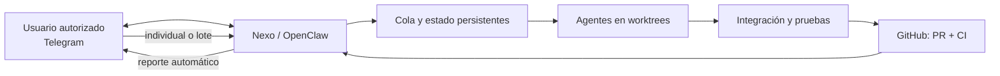

# Telegram — manual de operación de la flota

Telegram es el panel de control de Nexo. El usuario recibe allí los avances,
decide el nivel de autonomía y atiende únicamente las excepciones. GitHub
continúa siendo la fuente de verdad para issues, ramas, Pull Requests (PR),
checks y merges.

> **Estado al 2026-08-07:** el canal con allowlist, la cola, el runner y la
> aprobación individual en dos fases están instalados. Los mensajes
> automáticos y `aprobar todo` forman el contrato de la ampliación actual.
> Deben considerarse **pendientes de validación
> integrada en Telegram** hasta completar una ejecución real de extremo a
> extremo. El sistema nunca debe anunciar como fusionado algo que GitHub no
> confirme.

## 1. Qué significa «autónomo»

No hace falta mantener una conversación en Codex ni entrar a la VM para el
trabajo cotidiano. Con `AI_AUTONOMOUS_MODE=on`, la flota:

1. busca el issue abierto más antiguo con la etiqueta `agente:lista`;
2. lo bloquea para evitar que dos ejecuciones tomen el mismo trabajo;
3. planifica y reparte Backend, Tests y Docs en worktrees separados;
4. integra los resultados, verifica secretos y ejecuta las pruebas;
5. abre un único PR y espera que GitHub termine sus checks;
6. informa automáticamente por Telegram;
7. fusiona el PR individual o el lote actual que el usuario confirme;
8. limpia los worktrees y toma el siguiente issue elegible.

Autonomía no significa acceso ilimitado. El bot solo acepta intenciones
cerradas; no expone una shell y no convierte el texto de Telegram o de un issue
en comandos del sistema.



## 2. Primera conversación

Escribir al bot desde la cuenta incluida en `TELEGRAM_ALLOWED_CHAT_IDS`:

```text
/flota ayuda
/flota estado
```

Respuesta esperada a `ayuda`:

```text
Nexo · control de la flota
estado · siguiente · issue N · errores [N]
detener · reanudar
aprobar N · aprobar todo · confirmar CODIGO
rechazar N
```

`estado` debe indicar, como mínimo:

- si la admisión está activa o pausada;
- issue activo y fase;
- tamaño de la cola;
- PR pendiente y estado de CI;
- último resultado o bloqueo.

La cuenta no autorizada no recibe respuesta. Esta prueba desde una segunda
cuenta es obligatoria después de cambiar el bot, la allowlist o OpenClaw.

## 3. Mensajes que Nexo envía sin que se los pidan

Nexo reporta cambios de estado, no cada comando interno. El formato puede
variar, pero debe conservar issue, resultado, enlace y acción siguiente.

| Momento | Ejemplo del mensaje automático |
|---|---|
| Tarea aceptada | `🟦 Issue #12 aceptado. Próximo paso: planificación.` |
| Trabajo iniciado | `⚙️ Issue #12 iniciado. Agentes: backend, tests y docs.` |
| Reintento | `🟠 Issue #12: intento 2/3 en 5 min. Motivo redactado: falló una prueba.` |
| Bloqueo humano | `⏸️ Issue #12 bloqueado: la decisión puede generar coste. No se realizó ningún cargo.` |
| PR abierto | `📦 PR #18 abierto para issue #12: <enlace>. Esperando CI.` |
| CI verde | `✅ PR #18 listo. CI 6/6. Responde aprobar 18 o aprobar todo.` |
| CI fallida | `❌ PR #18 no es aprobable. Falló backend-tests. Usa errores 12.` |
| Aprobación pendiente | `🔐 PR #18 validado. Confirma con confirmar 4f… antes de 10 min.` |
| Merge | `🟢 PR #18 fusionado en <SHA>. Se limpiaron sus worktrees.` |
| Siguiente tarea | `➡️ Continúo automáticamente con issue #13.` |
| Cola vacía | `🏁 No quedan issues elegibles con agente:lista.` |
| Freno de seguridad | `🛑 Flota pausada automáticamente. Se requiere intervención.` |

Los reintentos repetidos se agrupan para evitar ruido. Ningún mensaje incluye
tokens, cookies, claves, contraseñas, `.env` completo ni logs sin redactar.

## 4. Comandos exactos

Las operaciones críticas se escriben **con `/`**. OpenClaw las procesa antes
del modelo mediante el plugin local `flota-control`; así funcionan aunque el
modelo esté saturado, falle con 401 o termine sin producir una respuesta.
`N`, `PR` y `CODIGO` son valores que Nexo entrega y no llevan texto adicional.

| Comando | Resultado |
|---|---|
| `/flota ayuda` | Lista el contrato disponible. |
| `/flota estado` | Resume flota, tarea, cola, PR y aprobación. |
| `/flota siguiente` | Encola el siguiente issue con `agente:lista`. |
| `/flota issue 12` | Encola únicamente el issue 12. |
| `/flota errores` o `/flota errores 12` | Resume fallos sin exponer logs. |
| `/flota detener` | Pausa la admisión; la tarea activa termina de forma controlada. |
| `/flota reanudar` | Quita la pausa y despierta el reconciliador. |
| `/aprobar 18` | Valida PR 18 y genera un código efímero para ese PR y SHA. |
| `/aprobar_todo` | Prepara un lote inmutable de PR aprobables y genera un código efímero. |
| `/confirmar CODIGO` | Ejecuta la aprobación individual o por lote ligada al código. |
| `/rechazar 18` | Rechaza/cierra el PR de integración 18; no borra evidencia. |

El texto conversacional puede seguir usándose para consultas, pero no debe
usarse para aprobar o cambiar estado: depende de la respuesta del modelo.

## 5. Elegir cómo aprobar

### Un PR — recomendado

Esta opción permite revisar cada cambio:

```text
Nexo: ✅ PR #18 listo. CI 6/6. https://github.com/.../pull/18
Tú:   aprobar 18
Nexo: PR #18 validado en 7ac91e2. Responde confirmar 91ab... antes de 10 min.
Tú:   confirmar 91ab...
Nexo: 🟢 PR #18 fusionado. Continúo con issue #13.
```

El código está ligado al usuario de Telegram, PR, SHA y vencimiento. Si cambia
el PR o la CI deja de estar verde, hay que solicitar uno nuevo.

### Lote actual — «aprobar todo»

Esta opción reduce intervenciones, pero no es un bypass de seguridad:

```text
Tú:   aprobar todo
Nexo: Lote preparado: PR #18 (7ac91e2), #19 (13b0f6a).
      Todos tienen CI verde. Responde confirmar c3d4... antes de 10 min.
Tú:   confirmar c3d4...
Nexo: Lote finalizado: #18 fusionado, #19 fusionado. Continúo con #20.
```

El lote es una fotografía inmutable. No activa un modo permanente ni aprueba
PR futuros. Solo incluye PR abiertos creados por la
flota, dirigidos a `main`, sin conflictos y con CI verde. Antes de cada merge
se vuelven a comprobar SHA, checks y pertenencia al lote. Si uno cambia o
falla, se omite y se informa; no se fuerza ni se usa bypass. Los PR creados
después de generar el código no quedan aprobados implícitamente.

> **Validación pendiente:** `aprobar todo` y su recuperación ante reinicio
> deben probarse de extremo a extremo antes de considerarse operativos. Hasta
> entonces, usar `aprobar N` individualmente.

## 6. Qué significa «aprobar todo» y qué no

`aprobar todo` autoriza únicamente el lote enumerado por Nexo. No autoriza:

- merges futuros ni una aprobación permanente;
- saltar CI, conflictos o protección de rama;
- desplegar producción;
- ejecutar migraciones destructivas o borrar datos;
- crear o rotar credenciales;
- activar APIs de pago, compras o proveedores con coste;
- publicar servicios en Internet;
- modificar la allowlist o ampliar permisos.

Esas operaciones siempre se detienen y se reportan, aunque se apruebe un lote.

## 7. Detener, reanudar y atender errores

`detener` es el freno cotidiano: impide admitir otra tarea pero no mata a mitad
de escritura la ejecución activa. Nexo confirma cuál quedó activa. Para una
emergencia real —secreto expuesto, bot respondiendo a desconocidos o actividad
destructiva— entrar por Tailscale y seguir la parada de emergencia de
[runbook.md](runbook.md#parada-de-emergencia).

```text
Tú:   detener
Nexo: Flota pausada. El issue #12 terminará de forma controlada; no iniciaré otro.
Tú:   estado
Nexo: Pausada · issue #12 integrating · cola 2 · sin aprobación pendiente.
Tú:   reanudar
Nexo: Flota reanudada. Revisaré la cola ahora.
```

Si falla una tarea:

```text
Nexo: ❌ Issue #12 agotó 3 intentos. Usa errores 12.
Tú:   errores 12
Nexo: Falló backend-tests. Resumen: 2 pruebas de migración no pasaron.
      No se fusionó nada. Evidencia local conservada.
```

Los logs completos permanecen en la VM para evitar filtrar secretos por
Telegram. Un fallo agotado no entra en un bucle infinito ni avanza solo.

## 8. Seguridad y límites

- Solo responden los `chat_id` de `TELEGRAM_ALLOWED_CHAT_IDS`.
- Telegram funciona por polling: no se abre ningún puerto del router.
- OpenClaw puede pedir acciones cerradas, no ejecutar shell arbitraria.
- El token del bot, GitHub, Codex y proveedores viven fuera del repositorio.
- Toda aprobación usa dos fases y un código efímero de un solo uso.
- El runner vuelve a validar CI y SHA justo antes del merge.
- Solo se toman issues marcados `agente:lista`, uno por vez.
- `main` no recibe push directo; GitHub decide el resultado del merge.
- La persistencia permite recuperar tareas después de reiniciar la VM.

Nexo nunca pedirá pegar una clave, contraseña, cookie o token en Telegram. Si
una credencial aparece en el chat, debe revocarse y rotarse desde su proveedor.

## 9. Flujo completo sin usar esta conversación

1. El usuario mantiene el roadmap como issues pequeños en GitHub.
2. Agrega `agente:lista` solamente a los autorizados para ejecución.
3. Nexo detecta el siguiente y manda `Issue aceptado` por Telegram.
4. Los agentes trabajan y Nexo solo reporta hitos o excepciones.
5. GitHub ejecuta CI; Nexo manda el enlace y el resultado.
6. El usuario usa `aprobar N` para uno o `aprobar todo` para el lote actual.
7. El usuario revisa el resumen y usa `confirmar CODIGO`.
8. Nexo vuelve a validar, fusiona, informa el SHA y continúa.
9. Si la cola queda vacía, Nexo informa y espera nuevos issues etiquetados.

La conversación con Codex queda reservada para mantenimiento extraordinario,
cambios de arquitectura o recuperación que exceda los comandos cerrados.

## 10. Solución de problemas desde Telegram

| Situación | Acción |
|---|---|
| Nexo no responde | Esperar un minuto y reintentar `estado`; luego revisar OpenClaw por Tailscale. |
| Responde `401` del proveedor | Reautenticar el proveedor; no enviar el token por Telegram. |
| `aprobar N` dice «no aprobable» | Abrir el enlace del PR y revisar CI, conflictos, base y rama de origen. |
| Código desconocido o vencido | Repetir `aprobar N` o `aprobar todo`; no reutilizar el anterior. |
| SHA cambió | Revisar nuevamente el PR y solicitar una aprobación nueva. |
| `siguiente` no encuentra trabajo | Confirmar que existe un issue abierto con `agente:lista` y que no hay otro PR de integración abierto. |
| La flota parece detenida | Ejecutar `estado` y, si dice pausada, `reanudar`. |
| Llegan demasiados mensajes | Usar `detener`; los reintentos deben agruparse por tarea. |
| El bot responde a otra cuenta | Emergencia: parar servicios y corregir la allowlist siguiendo el runbook. |

Diagnóstico local, rutas de estado y recuperación detallada:
[runbook.md](runbook.md). Máquina de estados y contrato técnico:
[ciclo-autonomo.md](ciclo-autonomo.md). Amenazas y rotación de credenciales:
[seguridad.md](seguridad.md).

## 11. Lista de aceptación antes de confiar en la aprobación por lote

- [ ] La cuenta autorizada recibe cada mensaje automático esperado.
- [ ] Una segunda cuenta no recibe respuesta.
- [ ] `detener` impide comenzar el siguiente issue.
- [ ] El reinicio conserva lote, tarea y eventos sin duplicar merges.
- [ ] Un código vencido, reutilizado o de otro chat es rechazado.
- [ ] Un cambio de SHA invalida la aprobación.
- [ ] Un check fallido excluye el PR del lote.
- [ ] Un PR ajeno a `integra/issue-*` nunca entra en el lote.
- [ ] Un lote parcial informa por separado cada merge y cada omisión.
- [ ] GitHub confirma todos los merges reportados por Nexo.
- [ ] No aparece ningún secreto en mensajes, eventos o logs de prueba.

Hasta completar esta lista, aprobar cada PR con `aprobar N`.
